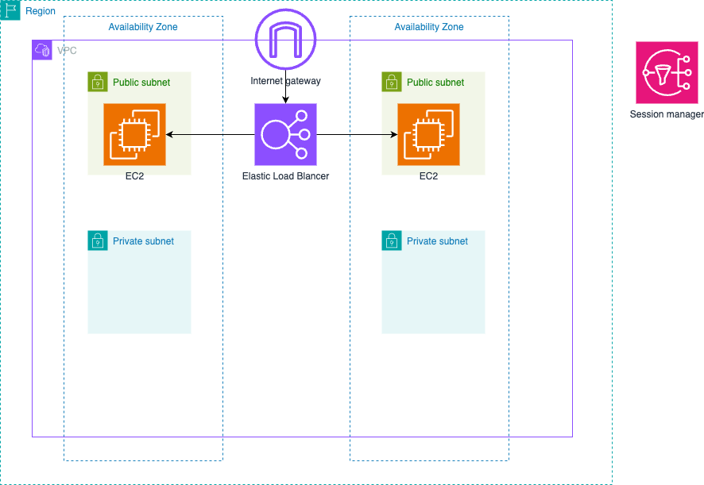

# AWS グランピングとは

AWS グランピングは、AWS 初心者が楽しみながら AWS のサービスを体験できることを目的としたコンセプトです。
通常、AWS の運用ではアカウント管理やコスト管理、リソース削除といった手間のかかる作業が必要ですが、このイベントではそれらを省略し、より気軽に AWS の魅力を味わっていただけます。

IAM ユーザーアカウントは主催者側で発行しますので、面倒な設定に時間を取られることなく、AWS の中で最も楽しい部分である「サービスを立ち上げる体験」に集中できます。ぜひ、この機会に AWS の世界をお楽しみください！

# AWS グランピング 1 日目

## ハンズオン

### 1. ハンズオンの概要

本ハンズオンでは、AWS 上で独自の仮想ネットワーク(VPC)を構築し、その中で EC2 インスタンスを起動して Web アクセスが可能な環境を整えます。また、セッションマネージャー(SSM)を使った安全なリモート接続や、Elastic IP を用いた固定 IP の割り当て、そして Application Load Balancer(ALB)による負荷分散を体験することで、AWS インフラ構築の基本的な流れと運用のポイントを理解します。

### 2. ハンズオンの手順

    1.VPCの作成:
    - AWS上で独自のネットワーク空間(VPC)を新規に作成し、プライベートクラウド環境の概念を学びます。
    2.サブネットの作成:
    - VPC内にパブリックサブネットを作成し、EC2インスタンスやALBなどのリソースが稼働する領域を用意します。
    - サブネットやルーティングなど、基本的なネットワーキング概念を整理します。
    3. SSMの有効化:
    - EC2インスタンスに対して、SSHキーなしで安全に接続できるAWS Systems Manager Session Manager(SSM)を有効化し、セキュアかつ運用管理が容易なアクセス方法を体験します。
    4.EC2インスタンスの起動とWebアクセス確認:
    - 先ほど作成したVPCとサブネットを指定してEC2インスタンスを起動し、ApacheやNginxなどのWebサーバをインストールします。
    - パブリックIPまたは一時的なDNS名を利用してブラウザからアクセスし、正常稼働を確認します。
    5.Elastic IPの割り当て:
    - EC2インスタンスにElastic IPを割り当て、再起動や一時停止後も変わらない固定IPでアクセス可能な状態を構築します。
    - Elastic IPを用いることで、ドメインの設定や運用フローが容易になることを理解します。
    6. ALBの作成とアクセス分散:
    - 最後にApplication Load Balancer(ALB)を作成し、EC2インスタンスをターゲットグループに登録します。
    - 負荷分散によって、可用性・拡張性のあるWebアプリケーション基盤を構築する方法を学びます。
    - ALB経由でWebサイトにアクセスし、正常動作を確認します。

このハンズオンを通して、AWS インフラ構築の基本的ステップ（ネットワークの構成、インスタンスの起動・管理、固定 IP アドレスの付与、そして負荷分散による拡張性確保）について、理論と実践の両面から学習することができます。

### 3. ハンズオンの注意点

このハンズオンを元に自分の環境で実施する場合は、不要なコストがかからないようにハンズオン後のリソース削除を忘れずに実施してください。
